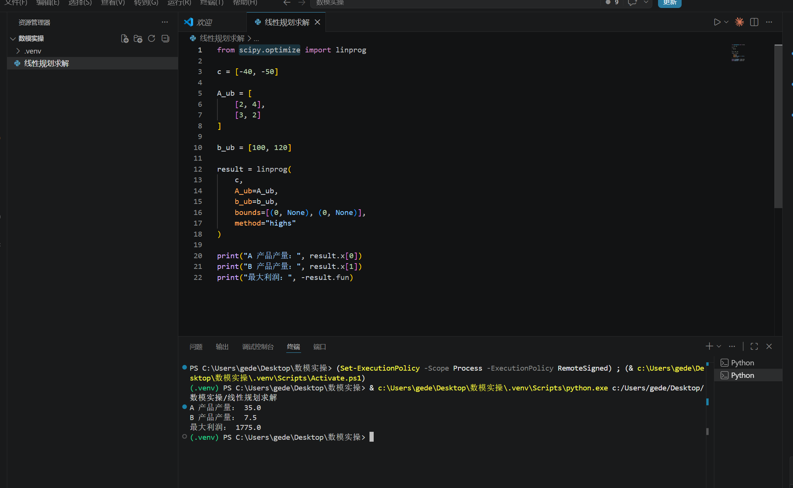

# 7.1 优化问题基本概括

**优化**（Optimization）是在给定约束条件下，选择决策变量的取值，使目标函数达到最优（最大或最小）的一类问题。它是数学建模中出现频率最高的模型类型之一：排产、路径、资源分配、参数拟合、投资组合等，本质上都可以写成优化问题。

---

## 三个基本要素

| 要素 | 含义 | 数模中的常见形式 |
|------|------|------------------|
| **决策变量** | 可以调控、需要求解的量 | 产量、选址 0-1 变量、权重、时间安排等 |
| **目标函数** | 衡量方案好坏的指标 | 利润最大、成本最小、误差最小、风险最小等 |
| **约束条件** | 决策必须满足的限制 | 资源上限、产能、流量守恒、逻辑约束等 |

约束条件所界定的可行取值集合称为**可行域**（feasible region）。优化问题本质上就是：在可行域上求目标函数的最值。

---

## 标准形式

一般优化问题可写为：

$$
\begin{aligned}
\min_{x \in \mathbb{R}^n} \quad & f(x) \\
\text{s.t.} \quad & g_i(x) \leq 0, \quad i = 1,\ldots,m \\
& h_j(x) = 0, \quad j = 1,\ldots,p
\end{aligned}
$$

- $f(x)$：目标函数  
- $g_i(x) \leq 0$：不等式约束  
- $h_j(x) = 0$：等式约束  
- s.t. 是 subject to 的缩写，表示“受约束于”

**最大化问题**可统一改写为最小化：

$$
\max f(x) \quad \Longleftrightarrow \quad \min \big(-f(x)\big)
$$

线性规划的常见矩阵形式：

$$
\begin{aligned}
\min \quad & \mathbf{c}^T \mathbf{x} \\
\text{s.t.} \quad & A\mathbf{x} \leq \mathbf{b} \\
& \mathbf{x} \geq 0
\end{aligned}
$$

---

## 局部最优与全局最优

- **全局最优解** $x^*$：对可行域内任意 $x$，都有 $f(x^*) \leq f(x)$（最小化情形）  
- **局部最优解** $x'$：存在邻域 $N$，对 $N$ 内所有可行点 $x$，有 $f(x') \leq f(x)$

当目标函数为凸函数、可行域为凸集时，局部最优也是全局最优；若目标还严格凸，则全局最优解至多一个。非凸问题不再有这样的保证，算法可能停在不同的局部极小点（见 7.7）。

---

## 数模中的建模思路

1. 先问清楚哪些量可以决定，把它们定义成决策变量；
2. 把“方案好坏”落到一个可以计算的目标上；
3. 按资源、逻辑和物理关系逐条写出约束，同时检查单位；
4. 根据变量类型和函数结构选择求解方法；
5. 求解后回到原问题，检查可行性，并讨论参数变化对方案的影响。

### 入门例子：生产计划

> 工厂生产 A、B 两种产品。A 利润 40 元/件，耗钢材 2 kg、工时 3 h；B 利润 50 元/件，耗钢材 4 kg、工时 2 h。钢材 100 kg、工时 120 h。如何安排产量使利润最大？

$$
\begin{aligned}
\max \; & 40x_A + 50x_B \\
\text{s.t.} \; & 2x_A + 4x_B \leq 100 \\
& 3x_A + 2x_B \leq 120 \\
& x_A, x_B \geq 0
\end{aligned}
$$

这是典型的**线性规划**（LP），可用单纯形法、图解法或 `scipy.optimize.linprog`、MATLAB `linprog` 求解。

若线性规划存在有限最优值，且可行域含有顶点，那么至少有一个最优解可以在顶点处取得。二维问题可以据此使用图解法：先画出各约束对应的半平面，找出公共可行域，再比较顶点的目标函数值，或平移目标函数等值线观察最优位置。

单纯形法把这个几何过程改写成代数运算。以原始单纯形法为例，算法从一个基本可行解出发，在相邻基本可行解之间移动，并持续改进目标值；若一开始没有现成的基本可行解，还要先做第一阶段求解。实际比赛中通常直接调用求解器，但理解这个过程有助于判断无解、无界和退化等情况。

下面是 `scipy.optimize.linprog` 的求解结果示例：

---

## 常用求解工具（速查）

| 问题类型 | Python | MATLAB |
|----------|--------|--------|
| 线性规划 | `scipy.optimize.linprog`，`pulp`，`cvxpy` | `linprog` |
| 整数/混合整数 | `pulp`，`ortools`，`cvxpy` | `intlinprog` |
| 非线性（连续） | `scipy.optimize.minimize` | `fmincon`，`fminunc` |
| 凸优化 | `cvxpy` | CVX 工具箱 |

---

## 小结

一个优化模型至少要写清决策变量、目标函数和约束。模型写完后，先检查它是否忠实反映题意，再判断变量是连续还是离散、函数是否线性或凸，以及数据中是否存在不确定性。分类的目的不是贴标签，而是为求解方法服务。
